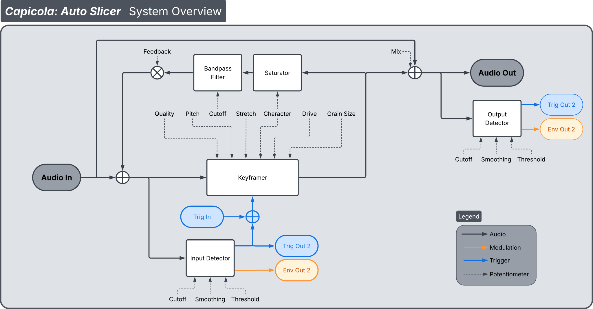
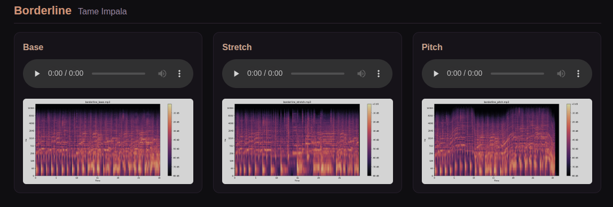

# Capicola
Real-time time stretcher, pitch shifter, transient detector, and envelope follower module built on the Hermetic Modular Alchemy Lab platform. This is the hardware embodiment of my independently authored, peer reviewed DAFx26 paper titled "[*Keyframe Time Stretching via Extrema Sampling*](https://github.com/heavylight-industries/dafx26-paper)". 

The core idea of the module is this: Incoming stereo audio gets stretched out, and in parallel its envelope and transients are extracted. When a transient passes the threshold, it causes the lagging read head to snap to the current time with a short crossfade, where then audio is stretched from the new position. This provides a means of time stretching while staying true to the rhythm of the input. The block diagram is shown below.



The input and output envelope followers and their transients don't just live internal to the module. They're always accessible on the CV outputs of the module to trigger and modulate external devices. Each of the performance controls is normalized to the envelope followers, enabling the dynamics of the signal to modulate the controls in real time, leading to some bizarre and creative self patching who's intensity is visualized by animating the LED rings.

KeyframeRecorder.h is the core method as described in the paper, and is set up not only for real time playback but also for offline recording and playback in contexts other than the Alchemy Lab. Additionally, lib contains several header files that are useful in their own right, namely:
- An implementation of Vadim Zavalashin's "Zero Delay Feedback" filters (1-pole, state variable)
- A "Deluxe" delay line class that offers not just Hermite or B-Spline interpolated reads from a ring buffer, but also 1st and 2nd derivatives and the Teager-Kaiser Energy Operator (TKEO).
- Tabulated function storage and recall for convenient low cost tanh(), sin(), and so on.
- A TKEO driven peak detector with adaptive thresholding

**Panel reference:** the
[interactive manual](https://heavylight-industries.github.io/capicola/manual.html)
(live faceplate render, per-page LED state) or [MANUAL.md](MANUAL.md) —
pages, buttons, jack map, fixed internals.

## Examples

[](https://heavylight-industries.github.io/time-stretching-examples/)

[**Audio examples**](https://heavylight-industries.github.io/time-stretching-examples/)
— time stretched and pitch shifted recordings with spectrograms, captured
under real-time control of the parameters.

These demonstrate the baseline keyframe engine on its own: sparsification,
adaptive splicing, and continuous time and pitch control, as described in the
paper. The transient driven multi grain slicing of capicola is not present in
these examples, what you hear is the engine alone. Capicola example audio and
in depth demonstrations will be posted soon both here and on my YouTube
channel, [Dialectric Studios](https://www.youtube.com/@dialectricStudios).

## AI Policy
The core engines contained within this repo are human created. The intellectual property of keyframe time stretching, the granular slicing engine, etc were developed by me and me alone. Before I knew if the keyframe engine was actually feasible for audio, I tried to have the AI the solve the problem for me, and it failed every time. It wasn't until I put in the hard work to translate my mental model of the sparse and uniform domains into C++ of my own creation that the engine sprung to life. 

That being said, I used AI to assist the creation of the documentation and the linking of my core code to the Alchemy Lab SDK. At the end of the day, it's a matter of efficiency, delegation, and using my own judgement to determine what tasks I hand off to it. 

## Layout

- `src/main.cpp` — the entire UI, utilizing the Alchemy Lab SDK.
- `src/audio/` — `AudioEngine`: owns the top level objects and audio routing.
- `lib/` — the DSP core.
- `lib/alchemy-sdk/` — the SDK (submodule); vendors libDaisy under
  `lib/alchemy-sdk/vendor/libDaisy`.

## Build

Requires `cmake ≥ 3.21`, `ninja`, `arm-none-eabi-gcc` (builds with 10.2.1;
the SDK nominally asks for ≥ 12), and `dfu-util` for flashing.

```sh
git submodule update --init --recursive    # first checkout only
cmake --preset arm
cmake --build --preset arm
```

Outputs `build-arm/capicola.{elf,bin,hex}`.

The `arm-bench` preset builds the same image with a 1 Hz CPU/CV serial log
on the front USB instead of HostLink (they share the CDC port) into
`build-arm-bench/`.

## Flash (Daisy bootloader / front USB-C)

Put the module in update mode (hold **B3** through the ~2 s boot window, or
hold while powering on), then:

```sh
cmake --build --preset arm --target capicola-flash
```
`...-size` prints the memory footprint.

## License

Capicola is free software, released under the **GNU Affero General Public
License v3.0** — see [LICENSE](LICENSE). If you ship hardware running a
modified capicola, you must offer the corresponding source.

Third-party code keeps its own terms: `lib/alchemy-sdk` (and the libDaisy
it vendors) are MIT-licensed submodules; see their `LICENSE` files.
